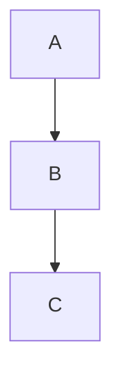
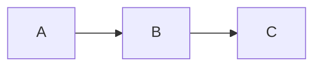
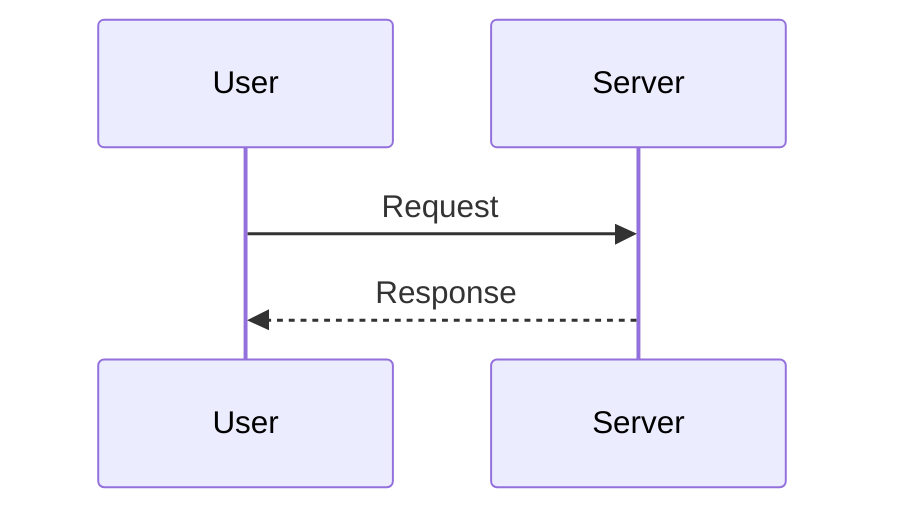

# Markdown Syntax Cheat Sheet

## Heading

```md
# Heading 1
## Heading 2
### Heading 3
#### Heading 4
##### Heading 5
###### Heading 6
```

---

## Paragraph

```md
This is a paragraph.

This is another paragraph.
```

---

## Line Break

```md
First Line  
Second Line
```

---

## Bold

```md
**Bold Text**
__Bold Text__
```

---

## Italic

```md
*Italic Text*
_Italic Text_
```

---

## Bold and Italic

```md
***Bold and Italic***
___Bold and Italic___
```

---

## Strikethrough

```md
~~Deleted Text~~
```

---

## Blockquote

```md
> This is a blockquote.
```

Nested:

```md
> Level 1
>> Level 2
>>> Level 3
```

---

## Unordered List

```md
- Item 1
- Item 2
- Item 3
```

Alternative:

```md
* Item 1
* Item 2
```

```md
+ Item 1
+ Item 2
```

---

## Nested Unordered List

```md
- Fruits
  - Apple
  - Mango
  - Banana
```

---

## Ordered List

```md
1. First
2. Second
3. Third
```

---

## Nested Ordered List

```md
1. Frontend
   1. React
   2. Angular
2. Backend
   1. Node.js
```

---

## Task List

```md
- [x] Completed
- [ ] Pending
```

---

## Inline Code

```md
Use `npm install`
```

---

## Code Block

````md
```javascript
console.log("Hello World");
```
````

---

## Syntax Highlighting

````md
```javascript
const name = "Ravi";
```

```typescript
interface User {
  id: number;
}
```

```python
print("Hello")
```
````

---

## Horizontal Rule

```md
---
```

```md
***
```

```md
___
```

---

## Link

```md
[Google](https://google.com)
```

---

## Reference Link

```md
[Google][1]

[1]: https://google.com
```

---

## Automatic URL

```md
<https://google.com>
```

---

## Email Link

```md
<example@gmail.com>
```

---

## Image

```md

```

---

## Clickable Image

```md
[](https://google.com)
```

---

## Table

```md
| Name | Age | City |
|------|-----|------|
| Ravi | 28  | Delhi |
| John | 30  | London |
```

---

## Table Alignment

```md
| Left | Center | Right |
|:-----|:------:|------:|
| A    | B      | C     |
```

---

## Escaping Characters

```md
\*Not Italic\*
\# Not Heading
```

---

## HTML Support

```md
<b>Bold</b>

<i>Italic</i>

<div>
Custom HTML
</div>
```

---

## Definition List (Supported in some Markdown processors)

```md
JavaScript
: Programming Language

React
: Frontend Library
```

---

## Footnotes

```md
Markdown is easy.[^1]

[^1]: This is a footnote.
```

---

## Superscript

```md
X^2^
```

---

## Subscript

```md
H~2~O
```

---

## Emoji

```md
:smile:
:rocket:
:heart:
```

---

## Highlight Text

```md
==Highlighted Text==
```

---

## Keyboard Keys

```md
Press <kbd>Ctrl</kbd> + <kbd>C</kbd>
```

---

## Collapsible Section (GitHub)

```md
<details>
<summary>Click Here</summary>

Hidden Content

</details>
```

---

## Checkboxes

```md
- [ ] Learn React
- [x] Learn JavaScript
```

---

## Mathematical Expressions (GitHub/Docs Support)

Inline:

```md
$E = mc^2$
```

Block:

```md
$$
a^2+b^2=c^2
$$
```

---

## Mermaid Diagrams

````md

````

---

## Flowchart

````md

````

---

## Sequence Diagram

````md

````

---

## GitHub Alerts

```md
> [!NOTE]
> Useful Information

> [!TIP]
> Helpful Advice

> [!WARNING]
> Warning Message

> [!IMPORTANT]
> Important Information

> [!CAUTION]
> Dangerous Action
```

---

## Table of Contents

```md
- [Introduction](#introduction)
- [Installation](#installation)
- [Usage](#usage)
```

---

## Comments

```md
<!-- This is a comment -->
```

---

## Common Markdown Files

```text
README.md
CHANGELOG.md
CONTRIBUTING.md
LICENSE.md
ARCHITECTURE.md
API.md
DESIGN.md
NOTES.md
AGENTS.md
```

---

## Most Frequently Used Syntax

````md
# Heading

## Sub Heading

**Bold**

*Italic*

~~Strikethrough~~

- List Item

1. Ordered Item

[Link](https://example.com)


`Inline Code`

```javascript
console.log("Hello");
````

> Blockquote

| Name | Age |
| ---- | --- |
| Ravi | 28  |

* [x] Task Done
* [ ] Task Pending

```
```
